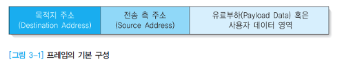
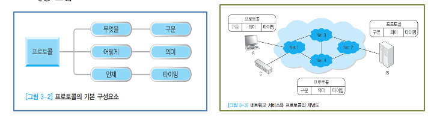
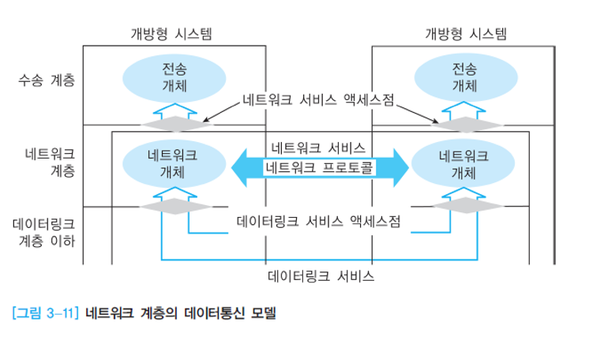
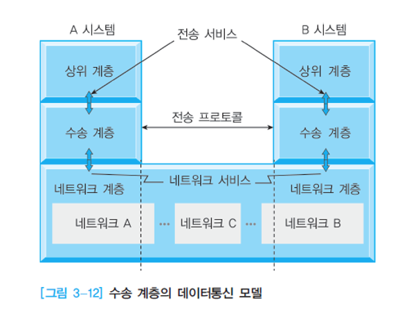
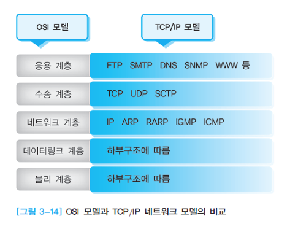
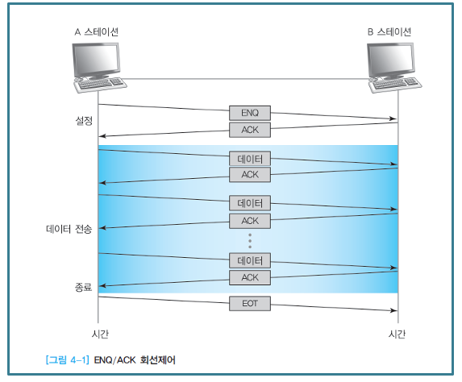
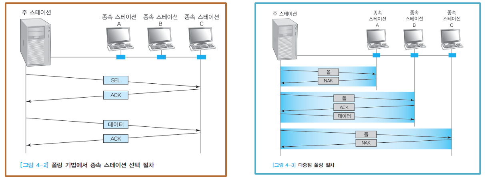
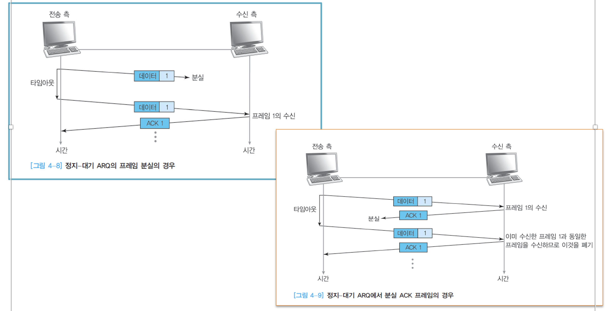
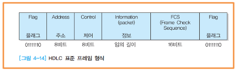

# 컴퓨터 네트워크 예상 출제문제

---

## 1. 데이터 전송 시 고려 사항에 대한 3가지를 서술하시오

1. **감쇄(attenuation)**
데이터가 전송 도중 흡수되거나 열에 의해서 변화가 되기 때문에 발생하는 전자파의 에너지 손실
최대 이용할 수 있는 거리는 전파가 전력을 감소하는 비율과 수신 측이 전자기파를 감지할 수 있는 전력량에 의존

2. **왜곡(distortion)**
링크상에서의 전파현상은 서로 다른 주파수에 따라 서로 다르게 감쇄되고 지연되어, 수신 신호가 전송 신호와 다르게 되는 현상
등화기(equalizer) : 서로 다른 주파수에서 서로 다른 왜곡을 보상해주는 장치

3. **잡음(noise)**  
도전체에서 전자의 열운동(thermal agitation)으로 인한 광자수의 불확실함으로 발생

---

## 2. 프레임(Frame)에 대해서 서술하시오 (PPT ch3 3페이지)

1. 프레임이란? 데이터링크 계층에서 사용되는 데이터 단위
2. 프레임의 기본 구성
목적지 주소 영역 : 목적지의 주소
전송 측 주소 영역 : 데이터를 보내는 전송 측의 주소
유료부하 영역 : 사용자 데이터

---

## 3. 프로토콜의 기본 구성요소 3가지를 서술하시오(PPT ch3 4페이지)

1. **구문 요소** : 데이터의 형식(format), 부호화 및 신호의 크기 등 요소 포함
2. **의미 요소** :  데이터의 특정한 형태에 대한 해석을 어떻게 할 것인가? 또한 이에 따라 어떻게 동작을 취할 것인가 등 전송의 조정 및 오류 등 요소 포함
3. **타이밍(timing) 요소** : 언제 데이터를 전송할 것인가와 얼마나 빠른 속도로 전송할 것인가와 같은 내용 포함

---

## 4. OSI 7계층에 대해서 나열하고 간략하게 각 계층마다 설명하시오

### 1. 물리 계층
1. 자신보다 상위에 있는 데이터링크 계층의 데이터통신 기능을 원활하게 수행하도록 물리적인 연결 설정과 유지 및 해제 기능과 관계됨
2. 기능 및 절차적(procedural) 명세 : 신호의 기능 명칭, 시간 조건, 절차 등을 규정, CCITT(현재 ITU-T)에서는 번호로 기능의 명칭을 표기하고, EIA에서는 영문과 숫자로 표기, 시간 조건과 절차는 신호 수신 시 시간 차이와 허용시간 오차 및 순서 관계를 표시
3. 전기적(electrical) 명세 : 신호선의 전원 인터페이스, 부하 인터페이스, 출력전압, 전원전압, 2진수의 논리적 표현, 한계값 등을 규정
4. 기계적(mechanical) 명세 : DCE/DTE에 연결되는 커넥터 및 데이터통신 링크에 연결되는 커넥터의 형태와 치수 및 신호 핀의 배열 등을 규정

### 2. 데이터링크 계층
1. 하부의 물리적인 연결을 통해 보다 신뢰성 있는 데이터 전송 수단을 제공하는 계층
2. 신뢰성 있는 데이터 전송을 위한 처리  
>데이터의 프레임화 : 데이터 전송 시 데이터를 일정한 길이로 분할하여 프레임 단위로 만듦
프레임의 순서제어 : 순차적인 프레임 전송을 위하여 프레임 번호를 부여
프레임의 전송 확인과 흐름제어 : 전송 측에서 여러 개의 프레임을 연속하여 전송하는 경우에, 전송되는 프레임이 정확하게 수신 측에 전송되었는가를 확인하고, 동시에 흐름제어도 수행
오류검출 및 복원 : 전송되는 프레임에는 오류 검출용의 비트열이 첨부되어 있으며, 수신 측에서는 이를 조사함으로써 프레임의 전송상 오류여부 판단

3. 프레임에 전송 오류가 발견되면 수신 측에서는 전송 측으로 재전송 요청
4. 데이터링크 연결 설정과 해제 : 프레임 전송에 앞서 수신 측이 데이터통신 가능상태에 있는지를 확인하여 데이터링크의 연결 설정

### 3. 네트워크 계층

1. 데이터링크 기능을 이용하여 네트워크 시스템 상호 간에 데이터를 전송할 수 있도록 경로배정(routing)과 중계(relay) 기능, 흐름제어, 오류제어 등의 기능을 수행하는 계층
>(예) BSC 전송제어 절차, HDLC 전송제어 절차, 멀티링크 전송제어 절차, IEEE 802 논리링크제어 등

2. 연결형 네트워크 서비스(ISO 8348)
>‘연결 설정 → 데이터 전송 → 연결 해제’라는 3단계를 거쳐 데이터통신이 수행
데이터의 순서제어와 흐름제어 과정이 비교적 간단하여 대량의 데이터를 연속적으로 전송하는 데 효율적

3. 비연결형 네트워크 서비스
>논리적 데이터통신 회선을 설정하지 않은 상태에서 프로토콜 데이터 단위(PDU)를 전송하는 방식
데이터에 대한 제어 기능을 갖지 않음
(장점) 네트워크 계층에 다른 통신 네트워크를 상호 연결이 용이하고, 기능 간략화 가능

### 4. 수송 계층(transport layer)

1. 수송 계층은 하부 네트워크와 독립적으로 신뢰성 있는 프로세스 상호 간의 완전한 메시지 전달기능을제공
>프로세스(process) : 호스트 컴퓨터에서 동작하고 있는 응용 프로그램(application program)

2. 완전한 메시지 전달기능을 제공하기 위해서 흐름제어와 오류제어, 메시지 전달 등의 기능을 수행

3. 하위 계층을 구성하는 다양한 데이터통신 네트워크의 품질의 차이를 보장하고 데이터통신에 적합한 종단 프로세스 내에서 데이터 전송을 보장하는 계층

4. 연결형 전송 프로토콜(ISO 8023, CCITT X.225) : 종단 간 데이터 전송 기능을 제공하기 위해 논리적인 데이터통신 회선을 설정하여 다중화, 분리, 연결, 오류 검출과 복원, 흐름제어, 우선 데이터 전송 등의 기능을 수행

### 5. 세션 계층(Session Layer)

1. 서로 다른 컴퓨터에서 동작되고 있는 두 개의 응용 계층 프로토콜 개체가 데이터를 전송하는 데 필요한 대화를 관리하고 조정
2. 순서에 따라 데이터를 조합하고 동기화하는 수단과 응용 계층 프로토콜 개체 간에 대화 채널을 설정하고, 해제하는 수단을 제공
3. 데이터 스트림에 검사 위치를 삽입하는 수단을 제공
4. 장애 발생 시 마지막 검사 위치 이후의 데이터만 재전송되도록 함으로써 대화 중단 시점에서 다시 연결해주는 부가적인 서비스를 제공

### 6. 표현 계층(Presentation Layer)

1. 두 사용자 응용 프로세스 간에 교환될 데이터의 형식과 관련되며, 사용자 데이터 전송을 위해 상호 동의하고 이해하는 형식으로 협상되도록 하는 수단을 제공
2. 예를 들면, 불어를 사용하는 사람과 중국어를 사용하는 사람 간에 통신이 이루어질 때 영어로 통역하는 것과 같이, 데이터 형식 변환의 개념과 관련된 기능을 제공해주는 계층임

### 7. 응용 계층(application layer)

1. OSI 참조모델의 최상위 계층

2. 자원(resource) 결정, 구문 확인 등의 기능과 정보처리를 수행하는 응용 프로그램 및 프로세스 간의 인터페이스, 데이터통신을 수행하기 위한 기본적인 응용 기능 제공

3. 공통 응용서비스 : 기본적인 응용 기능에 대하여 공통으로 사용되는 기능
>연계제어, 문맥제어, 정보 전송과 대화제어, CCR 제어 등

4. 특정 응용서비스 : 공통 응용서비스 이외의 기능
>단말기 제어 기능, 파일관리 기능, 작업조작 기능 등

---

## 5. OSI 모델과 TCP/IP 네트워크 모델을 비교하시오 (PPT ch3 18페이지)

1. 인터넷에서 사용하는 대표적인 프로토콜
2. TCP/IP 모델은 물리 계층, 데이터링크 계층, 네트워크 계층, 수송계층, 응용 계층 등 5개의 계층만으로 구성 [그림 3-14]
3. IP 프로토콜의 특성 : 비신뢰성 비연결형(unreliable connectionless) 데이터그램 프로토콜
4. TCP (Transmission Control Protocol)와 UDP(User Datagram Protocol)는 OSI 모델의 수송 계층에 해당
5. SCTP(Stream Control Transmission Protocol) 추가됨 – UDP와 TCP의 장점을 결합시켜 제어정보와 데이터정보를 분리하여 전송하는 방식

---

## 6. TCP/IP 모델 5계층에 대해서 나열하고 간략하게 각 계층마다 설명하시오 (PPT ch3 19~20)

### 1 and 2. 물리 계층과 데이터링크 계층
물리 계층과 데이터링크 계층에 대한 특정한 프로토콜은 규정하고 있지 않음

### 3. 네트워크 계층
1. IP 데이터그램은 IPv4인 경우 기본 20바이트로 구성되고 최대 60바이트까지 확장 가능
2. IPv4에서 IP 주소는 32비트의 이진수를 사용, IPv6에서는 이보다 4배인 128비트 영역으로 확장
3. 네트워크 계층에 해당하는 프로토콜 :  ARP와 RARP ICMP, IGMP 등
4. ARP와 RARP : IP 주소(IPv4인 경우 32비트)를 물리주소(이더넷 프로토콜인 경우 48비트)와 연계시키기 위한 프로토콜
5. ICMP : 전송 중인 IP 데이터그램에 문제가 있음을 통지
6. IGMP : 그룹화된 사용자들에게 동시 전송이 용이하도록 함

### 4. 수송 계층
1. OSI 모델의 수송 계층에 해당하는 프로토콜로 TCP와 UDP, SCTP가 있음
2. TCP는 프로세스 대 프로세스(process-to-process) 프로토콜
3. 종단간의 흐름제어, 에러제어 등의 기능이 있어서 신뢰성을 제공
4. 세그먼트(segment) : 두 호스트 간의 TCP 프로토콜 사이에서의 전송 단위

### 5. 응용 계층
1. TCP/IP 네트워크 모델에서는 OSI 모델의 세션 계층, 표현 계층, 응용 계층을 모두 결합하여 하나의 응용 계층이 됨
>(예) 이메일 프로토콜(SMTP), 파일전송 프로토콜(FTP), 도메인명 시스템(DNS), 웹 프로토콜(WWW)등 다양한 프로토콜

---

## 7. 회선제어 기능에서 ENQ/ACK 기법에 대해서 그림을 그려 설명하시오(PPT ch4 4페이지)
* ENQ/ACK 기법
1. 전용 전송 링크로 구성된 스테이션 사이에서 주로 사용되는 기법
2. A 스테이션이 ENQ 프레임을 전송하여 연결의 초기화를 진행
3. B 스테이션은 ACK을 전송하여 데이터 수신 준비되었음을 알림
4. 전송이 완료되면 EOT 프레임 전송 [그림 4-1]

---

## 8. 폴링기법에서 선택(Select)모드와 폴(poll)모드에 대해서 그림을 그려 비교 설명하시오(PPT ch4 5 페이지)
하나의 스테이션을 주 스테이션으로 지정하고 나머지는 종속 스테이션으로 구성

### 1. 선택(select) 모드
주 스테이션이 데이터를 전송하고자 할 때 사용하는 모드로, 주 스테이션이 링크에 대한 제어 권한을 가짐. [그림 4-2]
### 2. 폴(poll) 모드
주 스테이션이 다수의 종속 스테이션에게 보낼 데이터가 있는지의 여부를 확인하여 데이터 전송을 하는 모드   ->  ‘다중점(multipoint) 폴링 절차’
주 스테이션에서 폴 프레임을 전송하면 전송할 데이터가 없는 종속 스테이션은 NAK를, 전송할 데이터가 있는 종속 스테이션은 ACK를 보냄. [그림 4-3]

---

## 9. 정지-대기 ARQ 에 대해서 설명하시오(PPT ch4 10페이지)

데이터 프레임이 분실(lost data frame)된 경우의 절차 -> [그림 4-8]
ACK 프레임이 분실(lost ACK)된 경우에 대한 절차 -> [그림 4-9]

---

## 10. HDLC 프레임 형식에 대해서 그림을 그리고 각 부분으로 설명하시오(PPT ch4 16페이지)

### 1. 플래그(flag) 영역 : 프레임의 시작과 끝
1. 8비트. 고유의 패턴(01111110)으로 구성
2. 비트삽입(bit stuffing) 절차:  프레임의 처음이나 마지막이 아닌 중간에 1이 연속해서 5개 발생하면 뒤에 0을 추가

### 2. 주소 영역
1. 프레임을 수신하는 종속 스테이션(목적지 스테이션)을 식별하는 데 사용
2. 보통 8비트길이를 갖지만, 확장 형식을 사용할 수도 있음
3. 주 스테이션이 모든 부 스테이션에게 프레임을 방송할 때는 ‘11111111’ 주소값 사용

### 3. 제어 영역
정보 프레임(I-프레임), 감시 프레임(S-프레임), 번호가 붙지 않은 프레임(U-프레임)

### 4. 정보 영역(information field)
정보 영역은 I-프레임과 U-프레임에만 있으며, 길이는 정해져 있지 않으나, 일반적으로 구현 방법에 따라 특정한 최댓값을 갖고, 일반적으로 길이는 8비트의 배수가 되어야 함

### 5. FCS 영역
16비트 CRC CCITT 또는 CRC-32 사용

---

## 11. 자기 자신의 장점과 단점을 설명하고 장점을 이용하여 단점을 극복 할 수 있는 방법에 대해 설명하시오

ㄹㅇㅋㅋ
